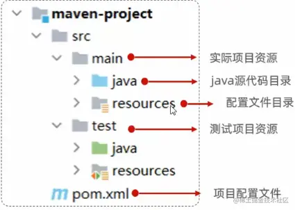
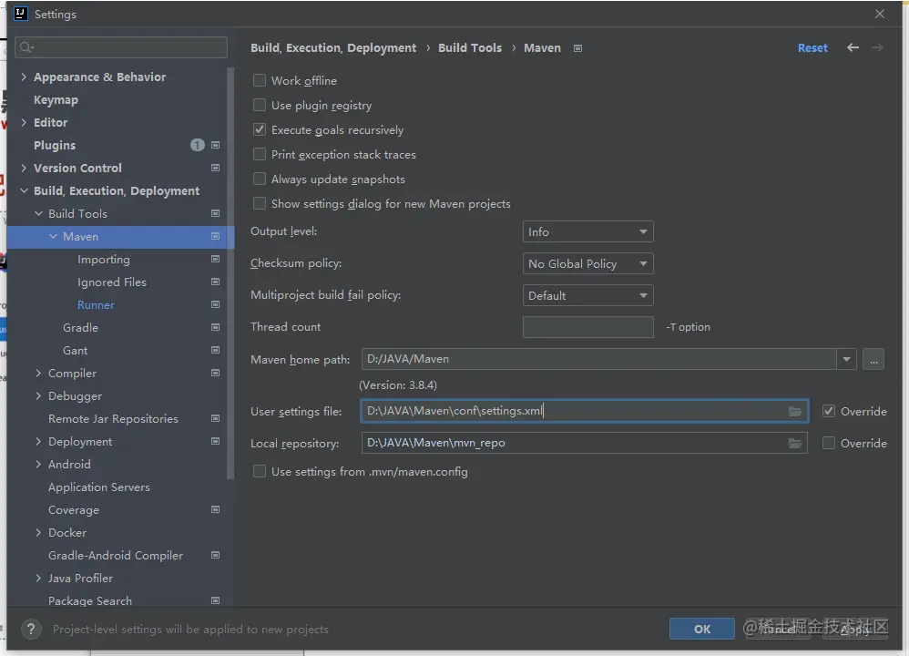
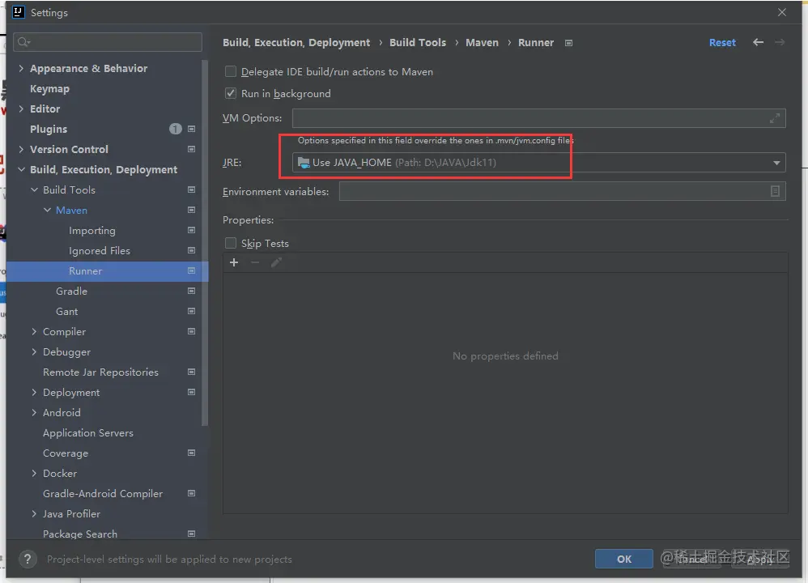
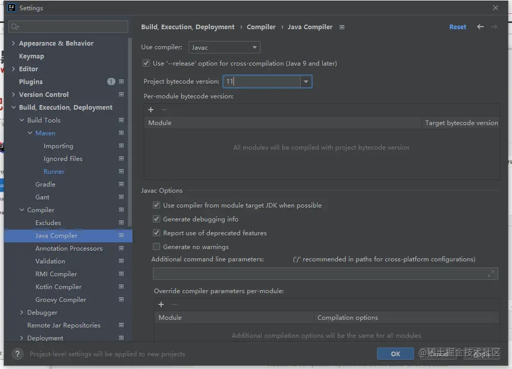
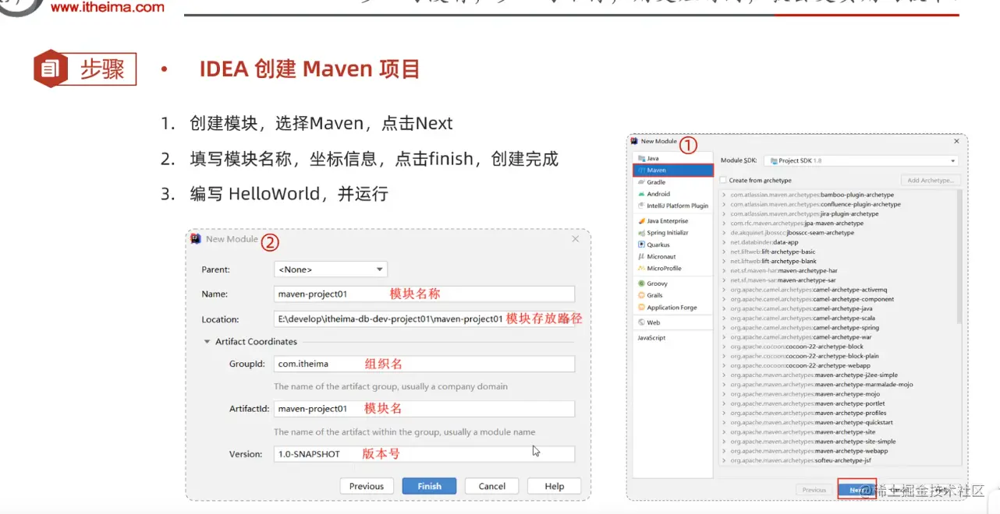

# 1.Day4.Maven 入门,JDK安装, Tomcat


# 第一部分

## 一.Maven介绍

下载链接： 
```
https://maven.apache.org/download.cgi
```

管理后构建Java项目的工具, 类似composer,配置文件为 :pom.xml, 功能包括:
- 1.依赖管理(它下载的依赖是jar包来的)
- 2.统一项目结构
- 3.项目构建





## 二.Maven安装, 相关目录
- 1.Maven安装目录 D:\JAVA\Maven\bin 

- 2.设置本地仓库, 修改Maven配置文件.大约55行左右

``` sh
# D:\JAVA\Maven\conf\settings.xml
<localRepository>D:\JAVA\Maven\mvn_repo</localRepository>
```

- 3.配置阿里云
```
<mirror>
    <id>aliyunmaven</id>
    <mirrorOf>*</mirrorOf>
    <name>阿里云公共仓库</name>
    <url>https://maven.aliyun.com/repository/public</url>
</mirror>
```

- 4.添加环境变量, D:\JAVA\Maven\bin
- 5.检查是否生效: mvn -v


## 三.在Iead中 全局配置Maven

- 1.jdk11下载: [JDK11下载](https://www.openlogic.com/openjdk-downloads?field_java_parent_version_target_id=406&field_operating_system_target_id=436&field_architecture_target_id=391&field_java_package_target_id=396)

- 2.全局配置(3步)








- 3.IDEA 创建Maven项目



## 四.生命周期


# 第二部分


## note2


- 目标是创建第一个spring boot程序, 并且在浏览器能够输入'hello world'

- 1.创建项目


- 2.勾选Spring Web (注意, 选择2.7.x版本就行, 不用选最新的)


- 3.创建完之后, 删除多余的文件夹(.idea 也删掉)


- 4.创建Controller


- 5.编写代码

``` java
package com.itheima.controller;
import org.springframework.web.bind.annotation.RequestMapping;
import org.springframework.web.bind.annotation.RestController;

// 添加Rest注解, 表示它是一个用于请求处理的类
@RestController
public class HelloController {
    // 用注解定义请求路由
    @RequestMapping("/hello")
    public String hello() {
        System.out.println("hello spring");
        return "hello spring";
    }
}
```

- 6.启动SpringBoot


- 7.打开浏览器
http://localhost:8080/hello
输出: hello spring


# 第三部分

## Tomcat

下载地址: 

```
https://tomcat.apache.org/download-90.cgi
https://dlcdn.apache.org/tomcat/tomcat-9/v9.0.78/bin/apache-tomcat-9.0.78-windows-x64.zip
```

绿色版, 直接解压就安装完了, 然后编辑 conf/logging.properties, 将
```
java.util.logging.ConsoleHandler.encoding 的 UTF-8 改成 GBK
```
启动 bin/startup.bat (如果打不开, 可能是idea启动了8080占用了)

如果需要改端口 conf/server.xml中port


#### 内嵌的Tomcat服务器 (后面一般用内嵌的)

