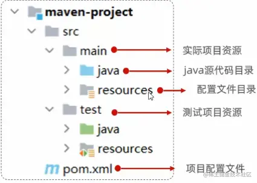
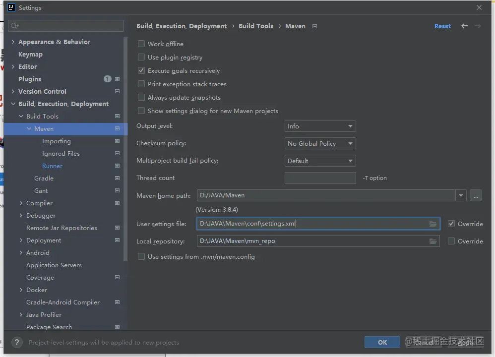
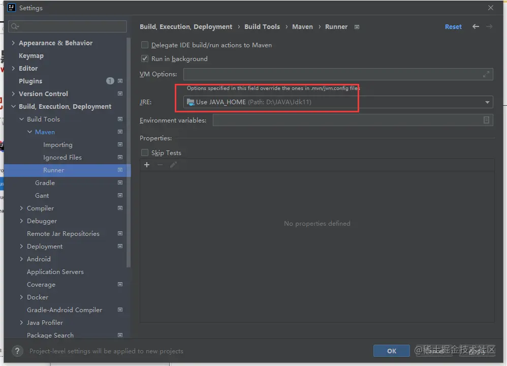
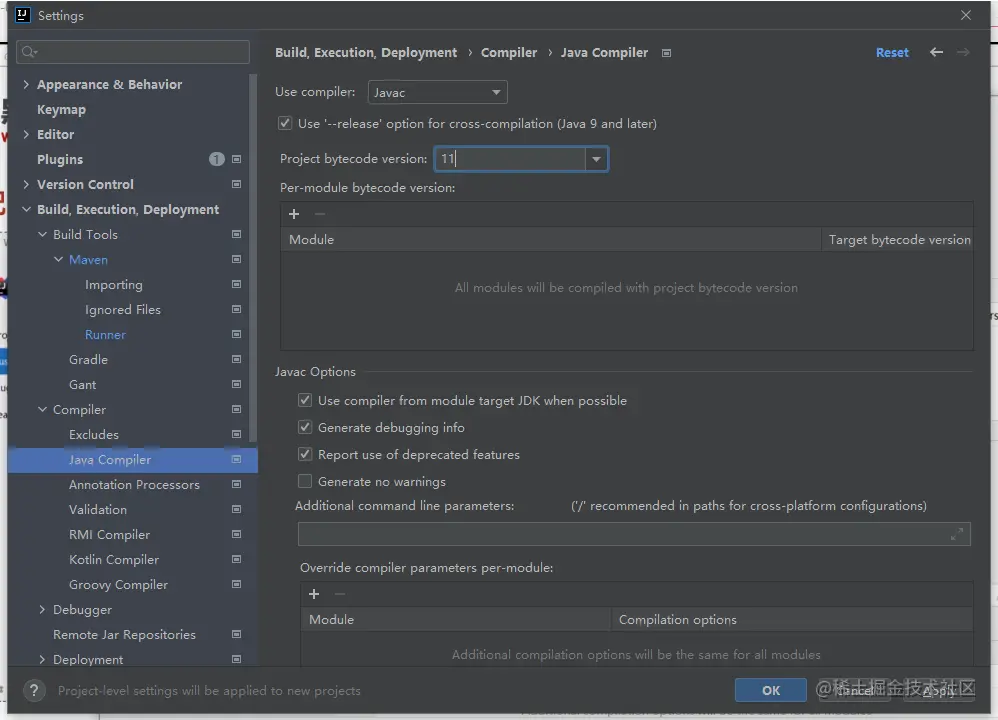
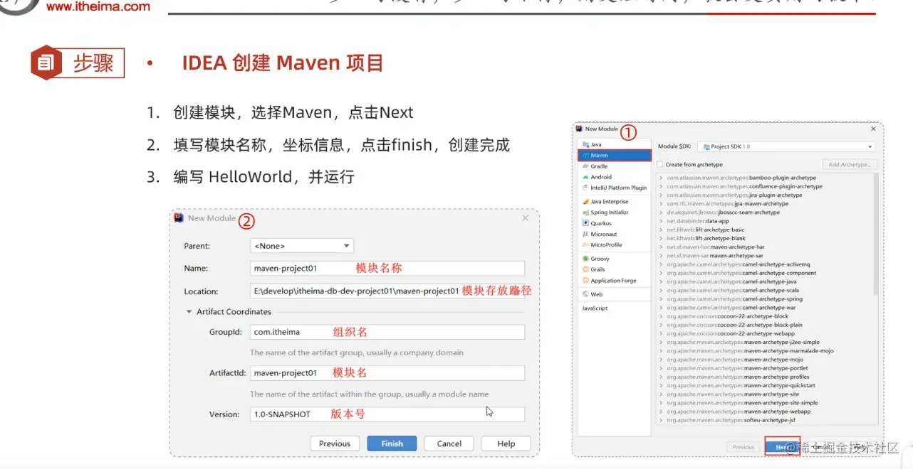

# 1.T4.Maven 入门,JDK安装, 共8节


# 一.Maven介绍

下载链接： 
```
https://maven.apache.org/download.cgi
```

管理后构建Java项目的工具, 类似composer,配置文件为 :pom.xml, 功能包括:
- 1.依赖管理(它下载的依赖是jar包来的)
- 2.统一项目结构
- 3.项目构建





# 二.Maven安装, 相关目录
- 1.Maven安装目录 D:\JAVA\Maven\bin 

- 2.设置本地仓库, 修改Maven配置文件.大约55行左右

``` sh
# D:\JAVA\Maven\conf\settings.xml
<localRepository>D:\JAVA\Maven\mvn_repo</localRepository>
```

- 3.配置阿里云
```
<mirror>
    <id>aliyunmaven</id>
    <mirrorOf>*</mirrorOf>
    <name>阿里云公共仓库</name>
    <url>https://maven.aliyun.com/repository/public</url>
</mirror>
```

- 4.添加环境变量, D:\JAVA\Maven\bin
- 5.检查是否生效: mvn -v


# 三.在Iead中 全局配置Maven

- 1.jdk11下载: [JDK11下载](https://www.openlogic.com/openjdk-downloads?field_java_parent_version_target_id=406&field_operating_system_target_id=436&field_architecture_target_id=391&field_java_package_target_id=396)

- 2.全局配置(3步)








- 3.IDEA 创建Maven项目



# 四.生命周期

