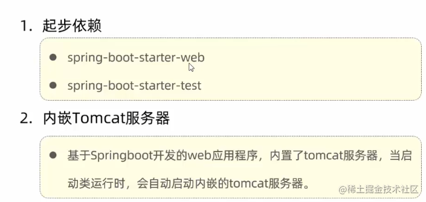

# 3.Day4.Tomcat

下载地址: 

```
https://tomcat.apache.org/download-90.cgi
https://dlcdn.apache.org/tomcat/tomcat-9/v9.0.78/bin/apache-tomcat-9.0.78-windows-x64.zip
```

绿色版, 直接解压就安装完了, 然后编辑 conf/logging.properties, 将
```
java.util.logging.ConsoleHandler.encoding 的 UTF-8 改成 GBK
```
启动 bin/startup.bat (如果打不开, 可能是idea启动了8080占用了)

如果需要改端口 conf/server.xml中port


#### 内嵌的Tomcat服务器 (后面一般用内嵌的)

