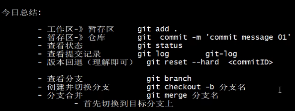

# Git

## 1.相关教程

1. 相关教程
- 按照教程所说, 最常用的还是ide中使用git

```
1.尚硅谷新版git(3小时)
https://www.bilibili.com/video/BV1wm4y1z7Dg/?spm_id_from=333.788.video.desc.click&vd_source=b620a69473c31bfeacc5e3bc26991cb3

2.狂神(快速入门)
https://www.bilibili.com/video/BV1FE411P7B3/?spm_id_from=333.337.search-card.all.click&vd_source=b620a69473c31bfeacc5e3bc26991cb3

3.黑马git(3.5小时) √ 选中
https://www.bilibili.com/video/BV1MU4y1Y7h5/?p=2&spm_id_from=pageDriver&vd_source=b620a69473c31bfeacc5e3bc26991cb3
```

2. 常用工具
    1. sourceTree 
    2. 乌龟版git


## 课程记录

1. 分布式版本库: 
    - 每个人电脑上都有一个完整的版本库


2. 安装和配置(P5)

```bash
  # 设置用户信息 
  $ git config --global user.name "用户名"
  $ git config --global user.email "邮箱"
  
  # 查看配置信息
  $ git config --global user.name
  $ git config --global user.email
```

3. 初始化本地仓库(P6)
    - 1.在桌面上新建一个GitTest目录
    - 2.右键 git bash here
    - 3.执行 `git init`

4. git基础操作(P6, 较长)

- 文件状态

| 1.工作区(workspace) | 2.暂存区(index) | 3.仓库(repository) |
| ------- | ------- | ------- |
| 1.未跟踪(untracked)  | -  | -  |
| 2.未暂存(unstaged)  | 3.已暂存(staged)  | commit  |

1. 未跟踪 (新建的文件)
2. 未暂存 (修改已经有的文件)
3. 已暂存 (提交到仓库前的暂缓区)

- 操作

1. `git add`  添加到暂存区

2. `git status` 查看状态

3. `git commit`  提交到仓库

4. `git log` 查看日志

```bash
git log [option]
    --all 显示所有分支
    --pretty=oneline 将提交信息显示为一行
    --abbrev-commit 使的输出commitld更简短
    --graph 以图的形式显示

# 常用: (可以加个别名)
# 1.按一行显示简短的日志
git log --pretty=oneline --abbrev-commit

# 2.按照分支显示简短日志
git log --pretty=oneline --abbrev-commit --all --graph 
```

### 指令别名, alias

1. 创建文件 `touch ~/.bashrc`

2. 编辑

```bash
alias git-log=' git log --pretty=oneline --all --graph --abbrev-commit'
```

 3. 生效  `source ~/.bashrc`
 

### 5. 版本回退 (退回到某个版本)

```bash
# git reset --hard 版本号
git reset --hard 12de115 

# 1.回退前
$ git log --pretty=oneline --abbrev-commit
6690452 (HEAD -> master) cn01
bd78eb8 edit file
44e8ffa edit file01
12de115 add file01

# 2.回退后 (发现后面提交的版本都不见了, 如果需要查看用git reflog)
$ git log --pretty=oneline --abbrev-commit
12de115 (HEAD -> master) add file01
```

6. 添加文件到忽略列表(.gitignore)

```bash
# 例如:
*.a
*.txt
*.log
```

### P9.分支

1. 查看分支 `git branch`

```bash
$ git branch
* master
```

2. 创建分支 `git branch demo01`

```bash
$ git branch demo01
$ git branch
  demo01
* master
```

3. 切换分支 `git checkout demo01`

```bash
$ git checkout demo01
Switched to branch 'demo01'

# 切换分支, 如果不存在, 直接创建分支
$ git checkout -b demo02
Switched to branch 'demo01'
```
4. 合并分支流程演示 `git merge`

```bash
# 1.切换到 demo01分支
$ git checkout demo01
Switched to branch 'demo01'

# 2.在当前demo01分支添加文件并提交 demo001.txt
$ touch demo001.txt
$ git add demo001.txt
$ git commit -m '在demo01分支添加demo001.txt'
 1 file changed, 0 insertions(+), 0 deletions(-)
 create mode 100644 demo001.txt

# 3.切换回master分支 (对, 先回master)
git checkout master

# 4.将demo01分支的内容合并到master (会进入一个类似vim界面, wq退出即可)

$ git merge demo01
Merge made by the 'ort' strategy.
 demo001.txt | 0
 1 file changed, 0 insertions(+), 0 deletions(-)
 create mode 100644 demo001.txt

# 5.查看log
$ git-log
*   4f51478 (HEAD -> master) Merge branch 'demo01'
|\
| * 4d6be01 (demo01) 在demo01分支添加demo001.txt
* | 66d0dfb ignore
|/
* 5dee31a 提交1

```

6. 删除分支 `git branch -d demo01`

### P10. 解决冲突 

- 1.在master分支创建dev01.txt,并修改内容,并提交

```demo001.txt
number=1
```

- 2.创建切换到dev01分支, 并切改dev01.txt内容并提交(注意要等第一步执行完再创建此分支)

```demo001.txt
number=2
```

- 3.切换回master分支, 先修改dev01.txt的内容(重点: 不要直接合并, 而是先修改, 然后切记要提交)

```bash
number=3
```

- 4.合并dev分支到master (注意这个`failed`)

```bash
$ git merge dev01
Auto-merging dev01.txt
CONFLICT (content): Merge conflict in dev01.txt
Automatic merge failed; fix conflicts and then commit the result.
```

- 5.此时打开dev01.txt查看 (目前在master分支)

```dev01.txt
<<<<<<< HEAD
number=3
=======
number=2
>>>>>>> dev01
```

- 6.重点: 解决冲突

    - 首先修改dev01.txt文件为自己想要的内容
    - 然后就add, commit提交即可

```dev01.txt
number=finaly
```

### P11.分支使用流程(学习中)

1. **master 分支**

线上分支, 主分支. 一般作为线上运行的分支

2. **develop 分支**

开发分支: 是从master创建的分支, 一般作为开发部门的主要分支, 开发完后合并到master分支


### P14.上半部分总结



### P15.快进模式

常见的分支修改后合并有两种情况, 这里以master和dev分支为例:
1. 只修改了dev, master分支未修改, 然后将dev合并到master, 此时会触发**快速模式**

2. dev和master分支都修改了(并各自提交)


