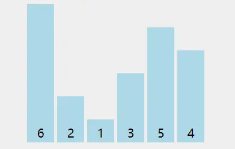

# 练习题

## 0.方向

##### 语言层面：
了解 PHP 8 语法特征，与 PHP 7 有什么不同，带来了那些改变。
了解现代框架，了解其高性能的原因，未来大部分 PHP 项目很可能都会基于此构建，比如 Workerman。Workerman 是什么
掌握的框架和熟练使用的某一框架。

#####  数据层面
MYSQL 的优化、索引、事务、数据类型，每一项都可以深入复习下。
盘点那些被问烂了的 Mysql 面试题

Redis 的基本知识、语法、数据类型，各种数据类型的运用环境。
在面试前必须要知道的 Redis 面试内容

关键事故术语背后是什么比如：缓存雪崩、穿透、死锁
Redis 击穿、穿透、雪崩产生原因以及解决思路

##### 网络层面
- TCP/IP 、HTTP1/HTTP2、套接字
- TCP/IP 协议
- 软件工程、架构
- 编程思想
- 代码风格 PHP 代码简洁之道
- 主流架构
- 算法

#### `php知识点`
- https://www.kancloud.cn/martist/be_new_friends
- https://www.kancloud.cn/martist/phper-will-get-bat-tmd-offer-in-2021

#### `其他`

看看 redis、mysql 方面的书，比如 redis 的《redis 运维与开发》、《redis 设计与实现》，mysql 方面可以看看掘金小册 小孩子的《从根上理解 mysql》。
计算机网络的话主要，可以看看 tcp 三次握手、四次挥手这些老掉牙的东西，还有 web 安全方面，比如 SQL 注入、XSS、CSRF 防范，还有设计模式，
另外 php 框架的源码也得看看一两个，主要生命周期，依赖注入、服务定位器什么之类。

## 1.手写算法

### 1.1 php实现冒泡排序

```php

// 冒泡排序 (错误写法)
function BubbleSort($arr) 
{ 
    for($i = 0; $i < count($arr); $i++) { 
        for($j = 0; $j < count($arr); $j++) { 
            echo "[i:{$i}]={$arr[$i]},  [j:{$j}]={$arr[$j]} " . PHP_EOL;
            if ($arr[$i] > $arr[$j]) { 
                $num = $arr[$i];
                $arr[$i] = $arr[$j];
                $arr[$j] = $num;
            } 
        } 
    } 
    return $arr; 
}

// 冒泡排序, 正确写法
function BubbleSortTrue($arr) 
{ 
    // (外层)循环控制冒泡的(轮数)
    for ($i = 0; $i < count($arr); $i++) { 

        // (内层)循环用于比较相邻元素并进行(交换)
        // 注意：每轮冒泡将当前未排序部分的最大元素移动到正确的位置
        // 因此，内层循环不需要再考虑已经排序好的元素，从而提高效率

        for ($j = 0; $j < count($arr) - $i - 1; $j++) { 
            // 如果前一个元素大于后一个元素，则交换它们的位置
            if ($arr[$j] > $arr[$j + 1]) {
                // 交换元素
                $temp = $arr[$j];
                $arr[$j] = $arr[$j + 1];
                $arr[$j + 1] = $temp;
            }
        } 
    } 
    // 返回排序好的数组
    return $arr; 
} 

$array = [4, 2, 7, 1, 9, 5];
$res = BubbleSortTrue($array); 
print_r($res);
// 结果 [1,2,4,5,7,9]
```



- 图中可以看出：
    -   第一轮排序将数字 6 移动到最右边；
    -   第二轮排序将数字 5 移动到最右边，同时中途将 1 和 2 排了序；
    -   第三轮排序时，没有发生交换，表明排序已经完成，不再继续比较

- `$i, 就是用来控制多少轮的, $j则是用来进行交换的`


### 1.2 二分查找算法

```php
function binarySearch($arr, $target) {
    $len = count($arr);
    $left = 0;
    $right = $len - 1;
    while ($left <= $right) {
        $mid = floor(($left + $right) / 2);
        if ($arr[$mid] == $target)
    }
}
```


## 2.常见练习题

### 2.1 php新特性


1. **标量类型声明 (PHP 7.0):** 增加了对标量类型的声明，提高了代码的可读性和可维护性。

2. **返回类型声明 (PHP 7.0):** 函数和方法现在可以指定返回类型，有助于更好地定义和理解代码的期望行为。

3. **可空类型 (PHP 7.1):** 允许在类型声明中使用 `null`，提高了对可空变量的处理。

4. **类型属性声明 (PHP 7.4):** 类可以有类型声明的属性，提高了面向对象编程的类型安全性。

5. **箭头函数 (PHP 7.4):** 引入了类似 JavaScript 的箭头函数，简化了匿名函数的写法。

6. **预加载 (PHP 7.4):** 允许在 Web 服务器启动时提前加载一些常用的类和文件，提高了性能。

7. **异常处理改进 (PHP 7.0 - 7.1):** 异常层次结构的改进和许多致命错误转换为异常，提高了异常处理的灵活性。

8. **合并赋值运算符 (`??=`) (PHP 7.4):** 允许在变量为 `null` 时进行赋值，简化了对可能为 `null` 的变量的处理。

9. **数组中的展开运算符 (`...`) (PHP 7.4):** 允许使用 `...` 运算符在数组中展开元素，提高了数组操作的灵活性。

10. **空合并运算符 (`??`) (PHP 7.0):** 提供了一种简洁的方法来处理变量可能为 `null` 的情况，减少了冗余的三元运算符。

- PHP7增`类型`，`空型``返回`与`标量`。
- `箭头函数``预加载`，`合并``运算`与`异常`。


#### 2.1.2 php8新特性

PHP 8 引入了多项重要的变化：

1. **即时编译（JIT）：** 引入 JIT 编译器，显著提升 PHP 脚本性能。
   
2. **属性：** 支持属性（Attributes），可在类、方法等结构上添加元数据。

3. **联合类型：** 允许变量具有多个类型之一，提高了类型灵活性。

4. **命名参数：** 引入了命名参数，通过参数名传递参数，提高了函数调用的可读性。

5. **匹配表达式：** 引入了 `match` 表达式，替代了一些复杂的 `switch` 语句。

6. **安全空值操作符：** 引入了 `?->` 运算符，简化了对可能为 `null` 的变量的访问。

7. **构造器属性提升：** 允许在类的构造函数中直接声明和初始化属性。

8. **弱映射：** 引入了弱映射，使得对象作为键时更容易被垃圾回收。

- `即时编译`与属性,表达式`联合类型`; 
- `命名参数`空操作,弱映射`构造属性`


### 2.2 自己显示substr方法, 主要是通过: `$str[$i]`来进行字符串的截取


## 3.Redis

缓存雪崩、穿透、死锁 Redis 击穿、穿透、雪崩产生原因以及解决思路

缓存雪崩、穿透、死锁，以及 Redis 击穿、穿透、雪崩是与缓存相关的一些常见问题。以下是它们的产生原因和解决思路：

### 1.缓存雪崩（重点1）：
**产生原因：** 大量缓存在同一时间失效，导致大量请求直接击穿数据库。
**解决思路：** 
   - 设置不同的过期时间，避免同时失效。
   - 引入缓存预热，提前加载热门数据。
   - 使用分布式锁，防止大量请求同时更新缓存。

### 2.缓存穿透（重点2）：
**产生原因：** 恶意请求或者查询不存在的数据，导致请求直接落到数据库。
**解决思路：** 
   - 使用布隆过滤器等机制拦截不存在的请求。
   - 缓存空值（Null Object Pattern）。
   - 对于频繁不存在的 key，设置短暂的缓存时间。

### 3.缓存死锁：
**产生原因：** 在分布式系统中，多个请求同时获取锁，但由于各种原因未能正确释放。
**解决思路：**
   - 使用分布式锁，确保锁的互斥性。
   - 设置锁的过期时间，防止死锁的持续发生。

### 4.Redis 击穿：
**产生原因：** 针对一个热点数据的大量请求，在缓存失效时直接访问数据库。
**解决思路：**
   - 设置热点数据永不过期或过期时间较长。
   - 使用互斥锁，保证只有一个请求去数据库查询。

### 5.Redis 穿透：
**产生原因：** 请求的 key 在缓存中不存在，且数据库中也不存在，导致频繁访问数据库。
**解决思路：**
   - 使用布隆过滤器过滤无效请求。
   - 缓存空值，避免频繁查询数据库。

### 6.Redis 雪崩：
**产生原因：** 缓存中的大量数据在同一时间失效，导致请求直接访问数据库。
**解决思路：**
   - 设置不同的过期时间，避免同时失效。
   - 使用缓存预热，提前加载热门数据。
   - 引入分布式锁，防止大量请求同时更新缓存。

综合来说，缓存问题的解决思路包括:
- A.设置合理的过期时间、
- B.使用分布式锁、
- C.引入缓存预热、
- D.使用布隆过滤器等机制

`以确保系统在缓存失效或请求高峰时能够保持稳定`


- 布隆过滤器(有点像in_array): 
    - 布隆过滤器是一种高效的数据结构，用于快速判断一个元素是否可能存在于一个集合中，具有较小的存储空间和快速查询的优点
    - 适用于缓存、防止缓存穿透等场景。可以使用第三方库如 `phpbloomd` 来方便地实现布隆过滤器。


### 应用场景

- 场景 1：**缓存雪崩**

- 1.1 `情景描述`：
假设你有一个热门商品列表，每个`商品`都被缓存在 Redis 中，并且这些商品的缓存都在同一时间失效。

- 1.2 `问题可能性`：
当这些缓存同时失效时，系统会接收到大量请求，这些请求会直接访问数据库获取商品数据，导致数据库压力剧增，可能导致数据库性能问题。

- 1.3 `解决思路`：

> 不同的过期时间： 给每个商品的缓存设置不同的过期时间，避免它们在同一时间失效。

> 缓存预热： 提前加载热门商品数据到缓存中，避免缓存失效时大量请求直接访问数据库。

场景 2：**缓存穿透**

- 2.1 情景描述：
假设你有一个根据用户 ID 缓存用户信息的系统，而有恶意用户发送不存在的用户 ID 请求。

- 2.2 问题可能性：
这些恶意请求会直接穿透缓存，导致系统每次请求都去数据库查询不存在的用户信息，造成数据库负担。

- 2.3 解决思路：

> 布隆过滤器： 使用布隆过滤器拦截不存在的用户 ID 请求，避免直接访问数据库。

> 缓存空值： 缓存不存在的用户 ID，避免频繁查询数据库。


## 4.MySQL优化